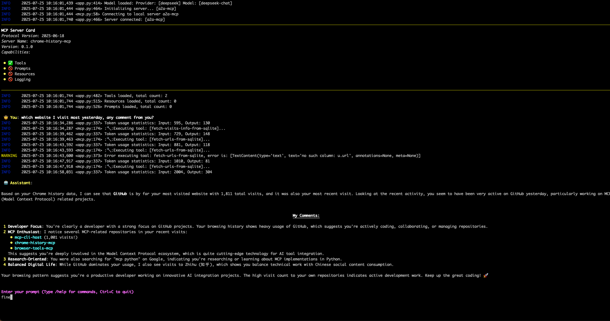

# A mcp server expose your Chrome history to AI

## Setup & Running

   ```bash
   uv run chrome-history-mcp
   ```
   It will use the default Chrome history path:
   - Windows:   
   C:\Users\<username>\AppData\Local\Google\Chrome\User Data\Default
   - macOS:   
   /Users/<username>/Library/Application Support/Google/Chrome/Default
   - Linux:    
    /home/<username>/.config/google-chrome/Default

   see the [details](https://www.foxtonforensics.com/browser-history-examiner/chrome-history-location)

   otherwise use the `--path` to define the path of history, for example: `/Users/lipeng/Library/Application Support/Google/Chrome/Profile 3/History`(if you have multiple user in Chrome)

   ```bash
   uv run chrome-history-mcp --path /Users/lipeng/Library/Application\ Support/Google/Chrome/Profile\ 3/History
   ```

## E2E

Leverage [mcp-cli-host](https://github.com/vincent-pli/mcp-cli-host) as mcp client

### Set STDIO server config
```json
{
  "mcpServers": {
    "a2a-mcp": {
      "command": "uv",
      "args": [
        "--project",
        "<location of the repo>",
        "run",
        "chrome-history-mcp",
        "--path",
        "<location of your chrome history>"
      ]
    }
  }
}
```

You can get this:



